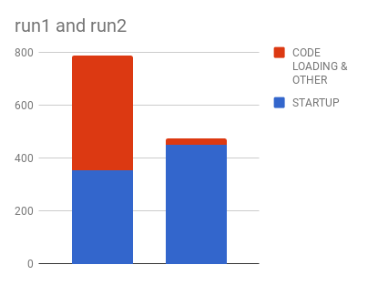
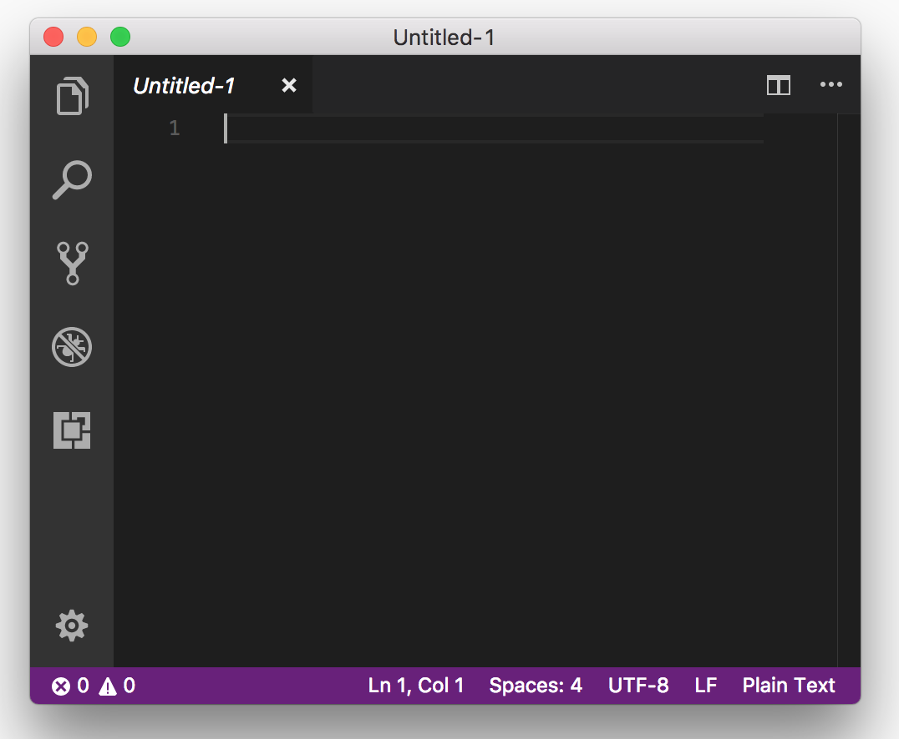

This is a repro for https://groups.google.com/forum/#!topic/v8-users/KddMkLLHh2w

### Setup
* clone repository
* `npm install .`
* `node setup.js`
  * this will download Electron and unpack it twice, under `~/tmp/electron-original` and `~/tmp/electron-snapshot`
  * we have two installations of Electron because we will *mess with* (change) one of it, we will change its `snapshot_blob.bin`.
* `node prepare.js`
  * this will create `~/tmp/bundle.js` (from the VSCode compilation output in `~/out`)
  * `~/tmp/bundle.js` will be loaded through `mksnapshot` and the `snapshot_blob.bin` will be placed in the expected location inside `~/tmp/electron-snapshot`

### Running
* both executions use `--no-lazy`
* `./run1.sh`
  * this executes Electron from `~/tmp/electron-original`.
  * this will create an Electron browser window from `index1.html`.
  * it will load via `vm` the script `~/tmp/bundle.js`.
  * on first execution, it will create `~/tmp/bundle-cached-data`, so please run at least twice to get good time measurements.
  * on second and subsequent executions, it will use `~/tmp/bundle-cached-data`.
  * finally, once `~/tmp/bundle.js` is loaded, it will invoke the benchmark.
* `./run2.sh`
  * this executes Electron from `~/tmp/electron-snapshot`.
  * this will create an Electron browser window from `index2.html`.
  * because we have created a snapshot from `~/tmp/bundle.js`, it does not need to load anything
  * it will directly invoke the benchmark

### Measurements
(Measurements done on a MacBook Pro, 2016, 3.3GHz Intel Core i7)
The first number is the total time, of which, the second number is invoking `'vs/workbench/electron-browser/main'.startup(configuration)` in ms. Each test is rerun by killing (ctrl+c) the executable from the terminal, i.e. not by reloading the window:
```
> ./run1.sh
1747, 359 # excluded
767, 366
723, 331
796, 347
799, 353
830, 373
802, 344
793, 357
789, 351
797, 355
795, 352
> ./run2.sh
746, 703 # excluded
458, 433
479, 455
475, 451
458, 437
481, 458
474, 451
457, 435
475, 452
482, 456
501, 478
```

* Average:
  * First column: `./run1.sh`: 789.1, 352.9
  * Second column: `./run2.sh`: 474.0, 450.6
  * invoking the startup code is 27% slower when using a startup snapshot
  <p align="center">
    
  </p>

### Ok, but what is this?

If you are curious to see what is actually executing, uncomment the `<link>` tag on line number 6 in `index1.html` or `index2.html` (the CSS is commented out to not affect measurements):
  <p align="center">
    
  </p>
